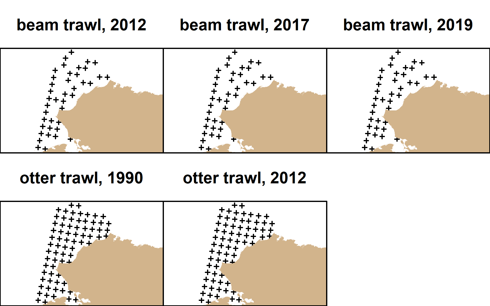

This repository contains preliminary operating models for Arctic (Chukchi Sea) 
groundfishes. Currently, vector autoregressive spatiotemporal models using the
[VAST package](https://github.com/James-Thorson-NOAA/VAST).

Contributors: Zack Oyafuso, Lewis Barnett, and Stan Kotwicki

## Versions
R version 4.0.2 (2020-06-22) was used for this analysis. Here are some relevant
package versions used:

| Package Name    | Version        |
|-----------------|----------------|
| VAST            | 3.6.1          | 
| TMB             | 1.7.19         |   
| FishStatsUtils  | 2.8.0          | 
| Matrix          | 1.2-18         | 
| INLA            | 21.02.23       | 
| dplyr           | 1.0.5          | 
| readxl          | 1.3.1          | 
| reshape         | 0.8.8          | 
| raster          | 3.4.5          | 
| sp              | 1.4.5          | 
| rgdal           | 1.5.23         | 
|                 |            | 

## Species List

## Spatiotemporal Extent of Stations

## Model Fitting Settings
Four versions of random field configurations were conducted for each 
single-species run.

| Spatial 1st Pred (Omega_1)| Spatial 2nd Pred (Omega_2)| Spatiotemporal 1st Pred (Epsilon_1)| Spatiotemporal 2nd Pred (Epsilon_2)|
|---------------------------|---------------------------|------------------------------------|------------------------------------|
| X                         | X                         |                                    |                                    | 
| X                         | X                         | X                                  |                                    | 
| X                         | X                         |                                    | X                                  | 
| X                         | X                         | X                                  | X                                  | 

200 knots were used

## Estimated Precision
|                            |      | Beam   Trawl |      |   | Otter   Trawl |      |
|----------------------------|------|--------------|------|---|---------------|------|
|                            | 2012 | 2017         | 2019 |   | 1990          | 2012 |
| Number of stations         | 42   | 58           | 45   |   | 69            | 72   |
|                            |      |              |      |   |               |      |
| Species                    |      |              |      |   |               |      |
| Alaska plaice              |      |              |      |   | 0.91          | 0.26 |
| Arctic cod                 | 0.23 | 0.2          | 0.25 |   | 0.49          | 0.16 |
| Arctic staghorn sculpin    | 0.26 | 0.25         | 0.35 |   | 0.77          | 0.16 |
| Bering flounder            | 0.25 | 0.4          | 0.31 |   | 0.25          | 0.19 |
| fuzzy hermit crab          | 0.27 | 0.26         | 0.34 |   |               |      |
| hairy hermit crab          | 0.5  | 0.38         | 0.39 |   |               |      |
| notched brittlestar        | 0.45 | 0.34         | 0.39 |   |               |      |
| saffron cod                | 0.62 | 0.57         | 0.58 |   | 0.98          | 0.34 |
| shorthorn (=warty) sculpin | 0.55 | 0.2          | 0.3  |   |               |      |
| slender eelblenny          | 0.26 | 0.25         | 0.26 |   |               |      |
| snow crab                  | 0.24 | 0.2          | 0.25 |   |               |      |
| walleye pollock            |      |              |      |   | 0.45          | 0.24 |
| yellowfin sole             | 0.97 | 1.14         | 1.04 |   |               |      |
