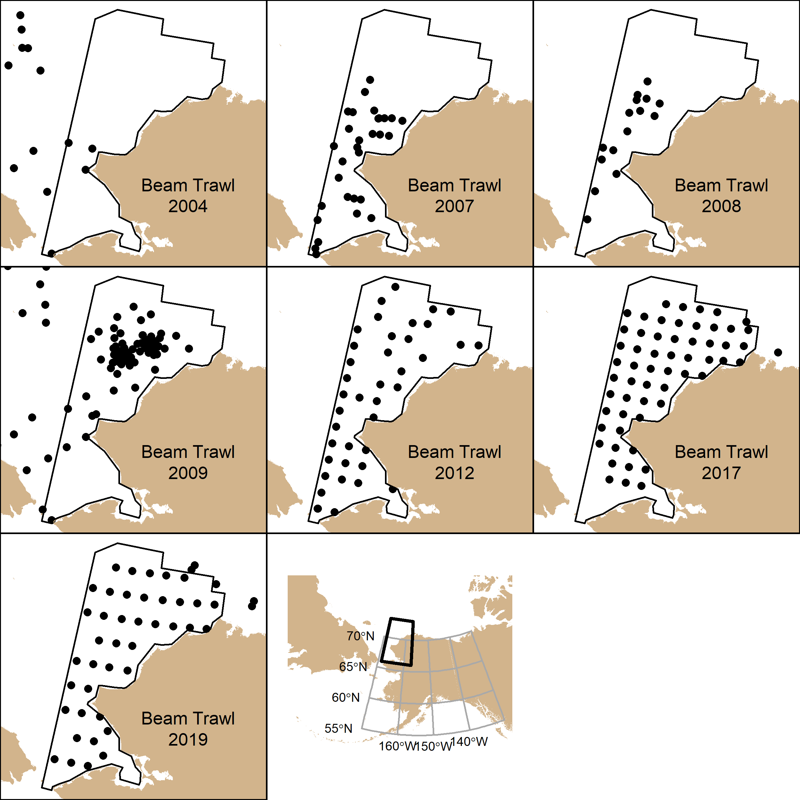
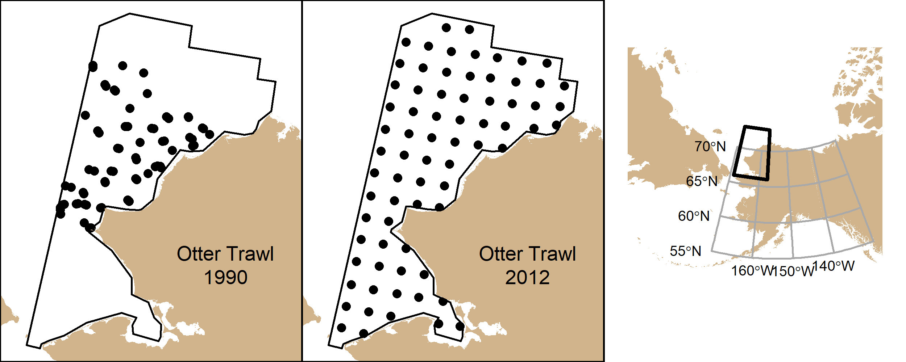

This repository contains preliminary operating models for Arctic (Chukchi Sea) 
groundfishes. Currently, vector autoregressive spatiotemporal models using the
[VAST package](https://github.com/James-Thorson-NOAA/VAST).

Contributors: Zack Oyafuso, Lewis Barnett, and Stan Kotwicki

## Versions
R version 4.0.2 (2020-06-22) was used for this analysis. Here are some relevant
package versions used:

| Package Name    | Version        |
|-----------------|----------------|
| VAST            | 3.6.1          | 
| TMB             | 1.7.19         |   
| FishStatsUtils  | 2.8.0          | 
| Matrix          | 1.2-18         | 
| INLA            | 21.02.23       | 
| dplyr           | 1.0.5          | 
| readxl          | 1.3.1          | 
| reshape         | 0.8.8          | 
| raster          | 3.4.5          | 
| sp              | 1.4.5          | 
| rgdal           | 1.5.23         | 
|                 |                | 

## Species List

## Spatiotemporal Extent of Beam Trawl Stations

## Spatiotemporal Extent of Otter Trawl Stations

## VAST Model Settings
Four versions of random field configurations were conducted for each 
single-species run. The converged models (e.g., max convergence < 1e-4)
with the lowest AIC was the best candidate model. No density or catchability
covariates were used at the moment. 200 spatial knots were used.

## Estimated Precision (pre-November 2021)
|                            |      | Beam   Trawl |      |   | Otter   Trawl |      |
|----------------------------|------|--------------|------|---|---------------|------|
|                            | 2012 | 2017         | 2019 |   | 1990          | 2012 |
| Number of stations         | 42   | 58           | 45   |   | 69            | 72   |
|                            |      |              |      |   |               |      |
| Species                    |      |              |      |   |               |      |
| Alaska plaice              |      |              |      |   | 0.83          | 0.23 |
| Arctic cod                 | 0.23 | 0.2          | 0.25 |   | 0.60          | 0.13 |
| Bering flounder            | 0.25 | 0.4          | 0.31 |   | 0.25          | 0.19 |
| saffron cod                | 0.62 | 0.57         | 0.58 |   | 1.94          | 0.83 |
| snow crab                  | 0.24 | 0.2          | 0.25 |   | 0.29          | 0.26 |
| walleye pollock            |      |              |      |   | 0.45          | 0.24 |
| yellowfin sole             | 0.97 | 1.14         | 1.04 |   | 0.91          | 0.39 |
